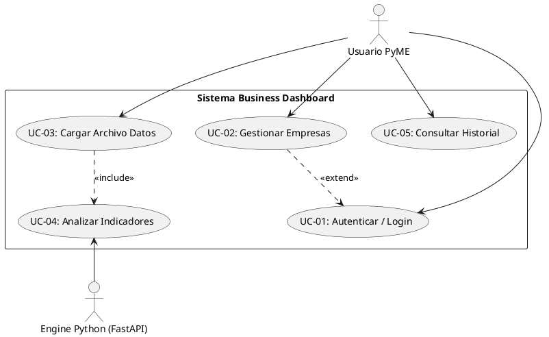
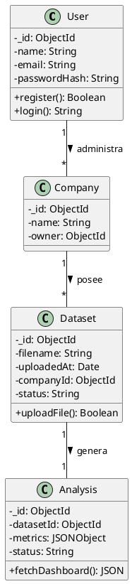
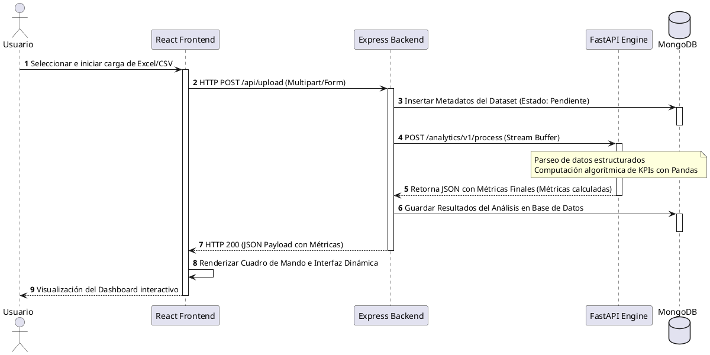

# Especificación de Requisitos de Software (ERS / SRS)
## Proyecto: Business Dashboard Automatizado para PyMEs

**Estándar:** IEEE 830-1998  
**Versión:** 1.1 (Soporte PlantUML)  
**Fecha:** Julio 2026  

---

## Índice
1. [Introducción](#1-introducción)
2. [Descripción General](#2-descripción-general)
3. [Requisitos Específicos](#3-requisitos-específicos)
4. [Modelado de Sistemas (Diagramas PlantUML)](#4-modelado-de-sistemas-diagramas-plantuml)
5. [Modelos de Datos y Contratos de API](#5-modelos-de-datos-y-contratos-de-api)

---

## 1. Introducción

### 1.1 Propósito
Este documento especifica los requisitos de software formales para la primera versión (MVP) y las iteraciones base de la plataforma **Business Dashboard para PyMEs**. Está dirigido a desarrolladores, arquitectos de software y stakeholders involucrados en el ecosistema.

### 1.2 Alcance
El sistema automatiza la ingesta y conversión de datos operativos planos (archivos de Excel y CSV) generados por pequeñas empresas en paneles interactivos (Dashboards) con KPIs de negocio calculados al instante, aislando la lógica analítica pesada en un microservicio de alto rendimiento.

---

## 2. Descripción General

### 2.1 Perspectiva del Producto
La plataforma opera como un software SaaS desacoplado. La interfaz gráfica se comunica vía REST con una API Gateway en Node.js/Express, la cual interactúa de forma síncrona/asíncrona con un motor analítico optimizado escrito en Python (FastAPI + Pandas).

### 2.2 Funciones del Producto
* Registro e inicio de sesión seguro de usuarios.
* Gestión integrada de múltiples perfiles corporativos (Multi-empresa).
* Ingesta, parseo y validación de estructuras en archivos planos.
* Computación algorítmica de KPIs económicos y métricas de venta.
* Despliegue visual dinámico en tiempo real y persistencia histórica.

---

## 3. Requisitos Específicos

### 3.1 Requisitos Funcionales (RF)

| Código | Requisito | Descripción | Prioridad |
| :--- | :--- | :--- | :--- |
| **RF-01** | Autenticación Segura | El sistema cifrará contraseñas con bcrypt y emitirá JSON Web Tokens (JWT) válidos para sesiones. | Alta |
| **RF-02** | Gestión Multi-empresa | Los usuarios podrán segmentar la información en múltiples espacios organizacionales independientes. | Alta |
| **RF-03** | Ingesta de Datos | Permitir carga mediante HTTP Multipart de archivos estructurados (.csv, .xlsx) de hasta 15MB. | Alta |
| **RF-04** | Motor Analítico | El sistema extraerá de forma automática: Ingreso Total, Ticket Promedio, Producto Top y Ventas Mensuales. | Alta |
| **RF-05** | Persistencia Histórica | Los JSON resultantes se almacenarán de forma nativa en colecciones documentales para acceso rápido retrospectivo. | Media |

### 3.2 Requisitos No Funcionales (RNF)

| Código | Categoría | Criterio de Aceptación |
| :--- | :--- | :--- |
| **RNF-01** | Rendimiento | El procesamiento analítico de un dataset de hasta 50,000 registros no superará los 2.5 segundos. |
| **RNF-02** | Arquitectura | Todo el stack tecnológico deberá estar dockerizado y orquestado de forma aislada e independiente. |
| **RNF-03** | Seguridad | Ningún endpoint operativo (salvo login/registro) procesará solicitudes que carezcan de un JWT verificado. |
| **RNF-04** | Interfaz | El diseño frontend responderá elásticamente (Responsive) a dispositivos móviles, tablets y PCs. |

---

## 4. Modelado de Sistemas (Diagramas PlantUML)

### 4.1 Diagrama de Casos de Uso


### 4.2 Diagrama de Clases


### 4.3 Diagrama de Secuencias (Carga y Análisis)


---

## 5. Modelos de Datos y Contratos de API

### 5.1 Estructura del JSON Analítico Retornado (FastAPI -> Express)
```json
{
  "status": "success",
  "kpis": {
    "total_revenue": 1500000.00,
    "average_ticket": 8600.50,
    "top_selling_product": "Notebook Pro 15",
    "total_orders": 174
  },
  "monthly_trends": [
    { "month": "Enero", "revenue": 450000 },
    { "month": "Febrero", "revenue": 520000 },
    { "month": "Marzo", "revenue": 530000 }
  ]
}
```
