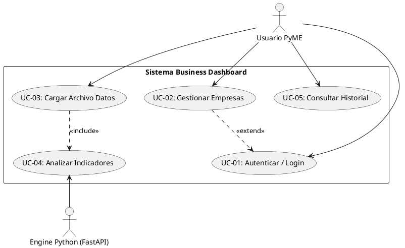
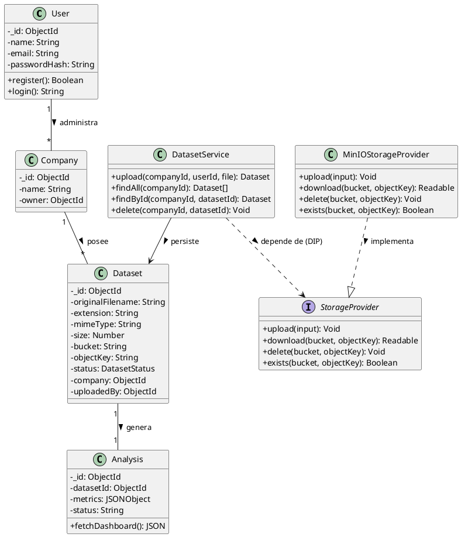
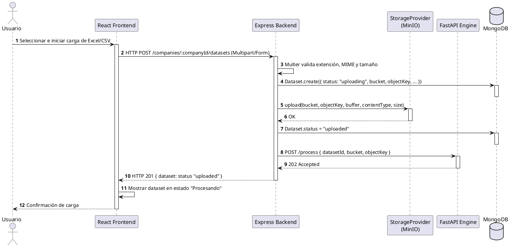
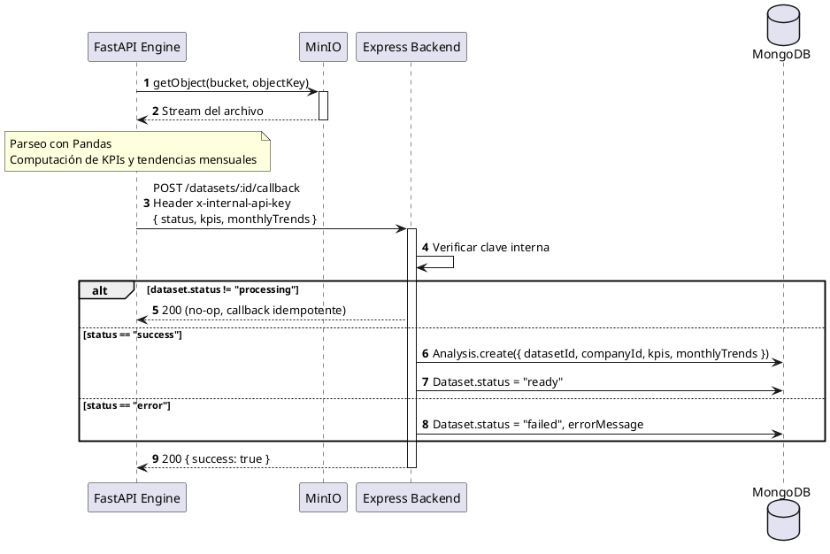
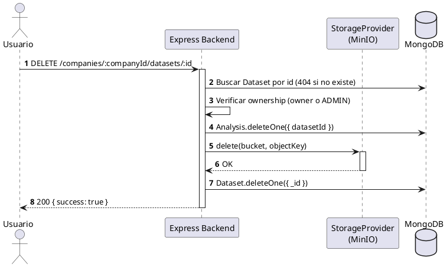
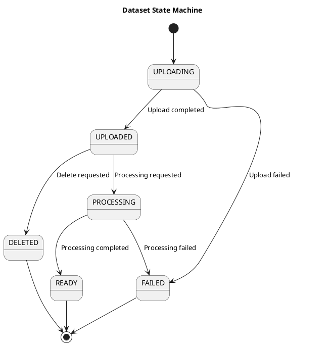

# Especificación de Requisitos de Software (ERS / SRS)

## Proyecto: Business Dashboard Automatizado para PyMEs

**Estándar:** IEEE 830-1998  
**Versión:** 1.3 (Dataset Module + MinIO Integration)
**Fecha:** Julio 2026

---

## Índice

1. [Introducción](#1-introducción)
2. [Descripción General](#2-descripción-general)
3. [Requisitos Específicos](#3-requisitos-específicos)
4. [Modelado de Sistemas (Diagramas PlantUML)](#4-modelado-de-sistemas-diagramas-plantuml)
5. [Modelos de Datos y Contratos de API](#5-modelos-de-datos-y-contratos-de-api)
6. [Decisiones Arquitectónicas: Almacenamiento y Procesamiento de Datasets](#6-decisiones-arquitectónicas-almacenamiento-y-procesamiento-de-datasets)

---

## 1. Introducción

### 1.1 Propósito

Este documento especifica los requisitos de software formales para la primera versión (MVP) y las iteraciones base de la plataforma **Business Dashboard para PyMEs**. Está dirigido a desarrolladores, arquitectos de software y stakeholders involucrados en el ecosistema.

### 1.2 Alcance

El sistema automatiza la ingesta y conversión de datos operativos planos (archivos de Excel y CSV) generados por pequeñas empresas en paneles interactivos (Dashboards) con KPIs de negocio calculados al instante, aislando la lógica analítica pesada en un microservicio de alto rendimiento.

---

## 2. Descripción General

### 2.1 Perspectiva del Producto

La plataforma opera como un software SaaS desacoplado. La interfaz gráfica se comunica vía REST con una API Gateway en Node.js/Express, la cual interactúa de forma síncrona/asíncrona con un motor analítico optimizado escrito en Python (FastAPI + Pandas).

### 2.2 Funciones del Producto

- Registro e inicio de sesión seguro de usuarios.
- Gestión integrada de múltiples perfiles corporativos (Multi-empresa).
- Gestión completa de datasets asociados a cada empresa (carga, consulta, listado y eliminación).
- Ingesta, parseo y validación de estructuras en archivos planos.
- Almacenamiento de archivos desacoplado de la base de datos operacional (Object Storage vía MinIO).
- Persistencia de metadatos de datasets en MongoDB.
- Computación algorítmica de KPIs económicos y métricas de venta.
- Despliegue visual dinámico en tiempo real y persistencia histórica.

---

## 3. Requisitos Específicos

### 3.1 Requisitos Funcionales (RF)

| Código    | Requisito                              | Descripción                                                                                                                                                                      | Prioridad |
| :-------- | :------------------------------------- | :------------------------------------------------------------------------------------------------------------------------------------------------------------------------------- | :-------- |
| **RF-01** | Autenticación Segura                   | El sistema cifrará contraseñas con bcrypt y emitirá JSON Web Tokens (JWT) válidos para sesiones.                                                                                 | Alta      |
| **RF-02** | Gestión Multi-empresa                  | Los usuarios podrán segmentar la información en múltiples espacios organizacionales independientes.                                                                              | Alta      |
| **RF-03** | Ingesta de Datos                       | Permitir carga mediante HTTP Multipart de archivos estructurados (.csv, .xlsx) de hasta 15MB, validados por extensión, MIME type y tamaño antes de llegar a la capa de servicio. | Alta      |
| **RF-04** | Motor Analítico                        | El sistema extraerá de forma automática: Ingreso Total, Ticket Promedio, Producto Top y Ventas Mensuales.                                                                        | Alta      |
| **RF-05** | Persistencia Histórica                 | Los JSON resultantes se almacenarán de forma nativa en colecciones documentales para acceso rápido retrospectivo.                                                                | Media     |
| **RF-06** | Almacenamiento Desacoplado de Archivos | El sistema persistirá los archivos binarios cargados en un Object Storage (MinIO) a través de una abstracción `StorageProvider`, nunca en MongoDB.                               | Alta      |
| **RF-07** | Gestión de Datasets                    | El sistema permitirá listar y administrar todos los datasets pertenecientes a una empresa con soporte para paginación y filtros.                                                 | Alta      |

### 3.2 Requisitos No Funcionales (RNF)

| Código     | Categoría                       | Criterio de Aceptación                                                                                                                                                                                      |
| :--------- | :------------------------------ | :---------------------------------------------------------------------------------------------------------------------------------------------------------------------------------------------------------- |
| **RNF-01** | Rendimiento                     | El procesamiento analítico de un dataset de hasta 50,000 registros no superará los 2.5 segundos.                                                                                                            |
| **RNF-02** | Arquitectura                    | Todo el stack tecnológico deberá estar dockerizado y orquestado de forma aislada e independiente.                                                                                                           |
| **RNF-03** | Seguridad                       | Ningún endpoint operativo (salvo login/registro) procesará solicitudes que carezcan de un JWT verificado.                                                                                                   |
| **RNF-04** | Interfaz                        | El diseño frontend responderá elásticamente (Responsive) a dispositivos móviles, tablets y PCs.                                                                                                             |
| **RNF-05** | Integridad de la Base de Datos  | MongoDB no contendrá, bajo ninguna circunstancia, buffers, binarios ni chunks de GridFS. Solo metadatos.                                                                                                    |
| **RNF-06** | Portabilidad del Almacenamiento | El módulo de Dataset dependerá exclusivamente de la interfaz `StorageProvider`; reemplazar MinIO por Amazon S3 o almacenamiento local no debe requerir cambios en `DatasetService`, controladores ni rutas. |

---

## 4. Modelado de Sistemas (Diagramas PlantUML)

### 4.1 Diagrama de Casos de Uso



### 4.2 Diagrama de Clases



### 4.3 Diagrama de Secuencias (Carga de Dataset)

> El archivo **nunca** viaja completo hacia FastAPI. Express lo escribe en MinIO a través del `StorageProvider` y solo notifica coordenadas (`datasetId`, `bucket`, `objectKey`).



### 4.4 Diagrama de Secuencias (Callback de Procesamiento)

> FastAPI descarga el archivo **directamente** de MinIO — nunca lo recibe de Express por HTTP. El callback hacia Express se autentica con una clave interna compartida, no con JWT de usuario.



### 4.5 Diagrama de Secuencias (Eliminación de Dataset)

> Orden fijo — Analysis, luego objeto en MinIO, luego el documento Dataset — elegido porque hace que todo el flujo sea reintentable de forma segura sin transacciones multi-documento.



### 4.6 Diagrama de Estados (Lifecycle del Dataset)

El siguiente diagrama representa el ciclo de vida completo de un dataset dentro del sistema, desde su creación hasta su eliminación.



---

## 5. Modelos de Datos y Contratos de API

> Las claves usan `camelCase` en todos los contratos, consistente con los esquemas Mongoose (`Analysis.kpis`, `Analysis.monthlyTrends`) ya implementados en la API.

### 5.1 Notificación de Procesamiento (Express -> FastAPI)

Enviada una única vez, inmediatamente después de que el `StorageProvider` confirma la escritura en MinIO. Nunca incluye el archivo.

```json
{
  "datasetId": "6650a1f2c9e4a2b1d8f0a123",
  "bucket": "datasets",
  "objectKey": "companies/6640.../6650a1f2c9e4a2b1d8f0a123.xlsx"
}
```

### 5.2 Callback de Procesamiento Exitoso (FastAPI -> Express)

`POST /datasets/:id/callback`, con header `x-internal-api-key`. El cuerpo mapea directamente al esquema `Analysis`:

```json
{
  "status": "success",
  "kpis": {
    "totalRevenue": 1500000.0,
    "averageTicket": 8600.5,
    "topSellingProduct": "Notebook Pro 15",
    "totalOrders": 174
  },
  "monthlyTrends": [
    { "month": "Enero", "revenue": 450000 },
    { "month": "Febrero", "revenue": 520000 },
    { "month": "Marzo", "revenue": 530000 }
  ]
}
```

### 5.3 Callback de Procesamiento Fallido (FastAPI -> Express)

```json
{
  "status": "error",
  "errorMessage": "Unsupported file format"
}
```

---

## 6. Decisiones Arquitectónicas: Almacenamiento y Procesamiento de Datasets

### 6.1 Contexto y Decisión

Se decidió, de forma deliberada, **no almacenar archivos dentro de MongoDB** (ni como buffers en un documento ni vía GridFS). En su lugar:

- **MongoDB** almacena únicamente metadatos (colección `datasets`, ver `docs/database_model.md §2.3`).
- **MinIO** almacena los archivos binarios (`.csv`, `.xlsx`).
- **FastAPI** lee los archivos directamente desde MinIO — nunca los recibe de Express por HTTP.

**Motivación:** desacoplar el crecimiento del almacenamiento de archivos del tamaño de la base de datos operacional, evitar los límites y la sobrecarga de GridFS para lecturas frecuentes, y dejar el camino abierto a mover el backend de almacenamiento (MinIO → S3, por ejemplo) sin migrar datos ni tocar lógica de negocio.

### 6.2 Patrón `StorageProvider` (Inversión de Dependencias)

El módulo de Dataset **nunca** sabe si los archivos están en disco local, MinIO o Amazon S3 — solo conoce una interfaz:

```typescript
interface UploadInput {
  bucket: string;
  objectKey: string;
  body: Buffer;
  contentType: string;
  size: number;
}

interface StorageProvider {
  upload(input: UploadInput): Promise<void>;
  download(bucket: string, objectKey: string): Promise<Readable>;
  delete(bucket: string, objectKey: string): Promise<void>;
  exists(bucket: string, objectKey: string): Promise<boolean>;
}
```

- **Primera implementación:** `MinIOStorageProvider`.
- **Implementaciones futuras:** `LocalStorageProvider`, `S3StorageProvider` — agregar una implica escribir un archivo nuevo e incorporarlo al `storage.factory.ts`; ni `DatasetService`, ni los controladores, ni las rutas cambian.
- `DatasetService` importa exclusivamente el tipo `StorageProvider` y la instancia resuelta por el _factory_ — nunca el SDK de MinIO.

### 6.3 Organización de MinIO

Existe **un único bucket** para toda la plataforma (`datasets`), organizado por prefijos — nunca un bucket por empresa:

```
datasets/                              (bucket)
  companies/
    <companyId>/
      <datasetId>.xlsx                 (nombre físico único, nunca el nombre original)
```

El nombre original del archivo se conserva en `datasets.originalFilename` (MongoDB) únicamente para mostrarlo en la interfaz. La clave física (`objectKey`) se construye a partir de `companyId` + `datasetId` generado + extensión validada — nunca a partir de un valor provisto por el usuario, para evitar path traversal y colisiones.

### 6.4 Flujo de Eliminación en Cascada

Orden obligatorio: **1) `Analysis` → 2) objeto en MinIO → 3) documento `Dataset`** (`docs/srs.md §4.5`).

Como MongoDB corre en un único nodo (sin replica set), no hay transacciones multi-documento disponibles. El orden elegido hace que la operación sea segura ante reintentos sin necesitarlas: si falla el paso 2, el documento `Dataset` (y su `objectKey`) sigue existiendo, así que un reintento repite la eliminación desde donde quedó; y borrar un objeto que ya no existe en MinIO/S3 no produce error. El resultado es que "no debe quedar ningún recurso huérfano" se cumple incluso ante una falla parcial, siempre que el cliente reintente la misma operación.

### 6.5 Seguridad del Canal Interno (FastAPI → Express)

El endpoint de callback (`POST /datasets/:id/callback`) **no** es una ruta de usuario: se autentica con una clave compartida (`x-internal-api-key`), no con JWT — un token de usuario válido no debe poder invocarlo. El callback es además **idempotente**: si el dataset ya no está en `processing` (porque el callback ya fue procesado), la solicitud responde `200` sin duplicar el `Analysis`, tolerando reintentos de red por parte de FastAPI.

### 6.6 Notas de Decisión

Dos comportamientos quedaron definidos como punto de partida, sujetos a revisión con datos de uso real:

- **Si la notificación a FastAPI falla** (servicio caído, timeout) después de que el archivo ya se escribió en MinIO, el dataset se marca `failed` con `errorMessage` y la carga responde `201` igualmente — el archivo está a salvo, pero el procesamiento no arrancó. Alternativa descartada por ahora: devolver `502` al cliente, que deja el archivo en MinIO sin una vía simple de vincularlo si no se hace rollback.
- **La carga usa buffer en memoria (`multer.memoryStorage`)** para la v1, consistente con el resto de la codebase. Bajo cargas concurrentes de archivos grandes, escribir en streaming directo hacia MinIO es la mejora natural — no bloqueante para esta versión.
